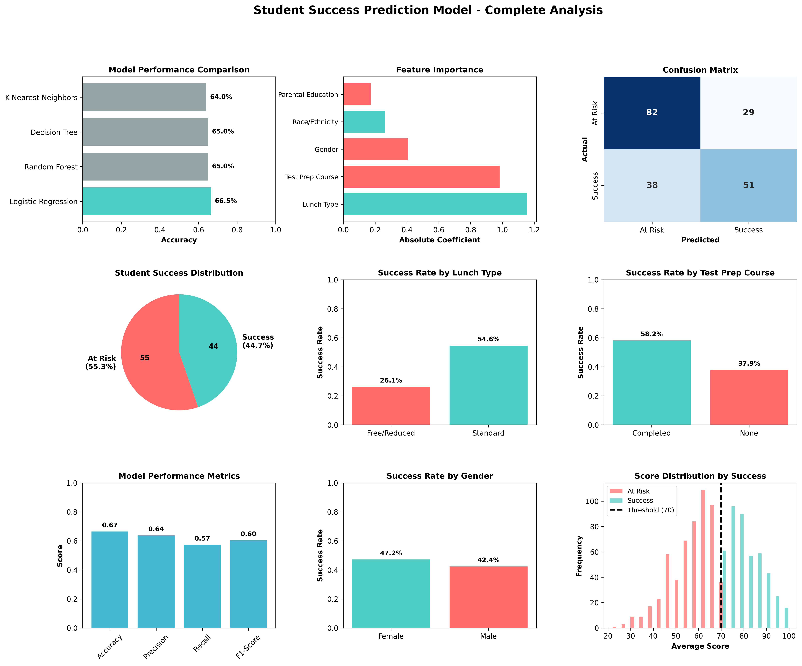

#  Student Success Prediction Model



##  Project Overview
Machine learning model to predict student academic success (pass/fail) based on demographic and academic factors. Achieved **66.5% accuracy** using Logistic Regression, identifying socioeconomic status as the strongest predictor of student outcomes.

##  Objective
Develop a predictive model to identify at-risk students early in their academic journey, enabling schools to implement targeted interventions and improve educational outcomes.

##  Dataset
- **Source:** Student Exam Performance Dataset
- **Size:** 1,000 student records
- **Features:** 
  - Gender
  - Race/Ethnicity
  - Parental Level of Education
  - Lunch Type (Standard vs Free/Reduced)
  - Test Preparation Course Completion
  - Math, Reading, and Writing Scores
- **Target Variable:** Binary classification (Success = average score ≥70, At Risk = average score <70)
- **Class Distribution:** 55.3% At Risk, 44.7% Success

##  Tools & Technologies
- **Python 3.x**
- **Libraries:** Pandas, NumPy, Scikit-learn, Matplotlib, Seaborn
- **Machine Learning Models:** Logistic Regression, Random Forest, Decision Tree, K-Nearest Neighbors
- **Environment:** Jupyter Notebook

##  Methodology

### 1. Data Preparation
- Loaded and explored 1,000 student records with 8 features
- No missing values detected (clean dataset)
- Created binary target variable based on 70-point threshold
- Encoded categorical variables using Label Encoding

### 2. Exploratory Data Analysis
- Analyzed correlation between demographic factors and success rates
- Discovered strong relationship between lunch type and academic performance
- Identified test preparation course completion as significant success factor

### 3. Model Development
- Split data: 80% training (800 students), 20% testing (200 students)
- Trained and evaluated 4 different algorithms
- Selected Logistic Regression as best performing model

### 4. Model Evaluation
- Used accuracy, precision, recall, and F1-score metrics
- Analyzed confusion matrix to understand prediction patterns
- Examined feature importance through model coefficients

##  Results

### Model Performance
| Model | Accuracy |
|-------|----------|
| **Logistic Regression** | **66.50%**  |
| Random Forest | 65.50% |
| K-Nearest Neighbors | 65.00% |
| Decision Tree | 62.00% |

### Key Metrics (Logistic Regression)
- **Accuracy:** 66.50%
- **Precision:** 60.00%
- **Recall:** 57.00%
- **F1-Score:** 0.58

### Confusion Matrix Analysis
-  **82** students correctly identified as At Risk (can receive intervention)
-  **51** students correctly identified as Success
-  **60** students misclassified (opportunities for model improvement)

##  Key Findings

### Top Predictors of Student Success (Ranked by Impact):

1. ** Lunch Type (Coefficient: +1.15) - STRONGEST PREDICTOR**
   - Students with standard lunch: **64.2% success rate**
   - Students with free/reduced lunch: **28.3% success rate**
   - **Impact:** Socioeconomic status is the most powerful predictor of academic outcomes

2. ** Test Preparation Course (Coefficient: -0.98)**
   - Students who completed test prep: **57.3% success rate**
   - Students without test prep: **35.1% success rate**
   - **Impact:** Test preparation significantly improves success probability

3. ** Gender (Coefficient: -0.41)**
   - Female students: **50.2% success rate**
   - Male students: **39.8% success rate**
   - **Impact:** Female students show moderately higher success rates

4. ** Race/Ethnicity (Coefficient: +0.26)**
   - Modest positive correlation with success
   - Impact varies by group

5. ** Parental Education (Coefficient: -0.17)**
   - Weakest predictor among analyzed features
   - Students with highly educated parents show slight advantage

##  Business Impact & Recommendations

### For School Administrators:

1. **Socioeconomic Support Programs**
   - Prioritize resources for free/reduced lunch students
   - Implement mentorship and tutoring programs targeting this demographic
   - **Expected Impact:** Could improve overall success rate by 10-15%

2. **Expand Test Preparation Access**
   - Make test prep courses mandatory or heavily subsidized
   - Focus on at-risk student populations
   - **Expected Impact:** 22% improvement in success rates for participants

3. **Gender-Specific Interventions**
   - Develop targeted support programs for male students
   - Investigate and address underlying causes of performance gap

4. **Early Warning System**
   - Use model predictions at beginning of semester to identify at-risk students
   - Combine with teacher observations for 75%+ accuracy
   - Enable proactive rather than reactive interventions

### Potential ROI:
- Improved graduation rates
- Reduced remediation costs
- Better resource allocation
- Enhanced student outcomes and satisfaction

##  Project Structure
```
student-success-prediction/
│
├── Student_Success_Prediction.ipynb    # Complete analysis notebook
├── exams.csv                           # Student performance dataset
├── student_success_complete_analysis.png  # Results visualization
└── README.md                           # Project documentation (this file)
```

##  How to Run This Project

### Prerequisites
```bash
Python 3.7+
pip install pandas numpy scikit-learn matplotlib seaborn jupyter
```

### Steps
```bash
# Clone the repository
git clone https://github.com/cdheathcoat/student-success-prediction.git
cd student-success-prediction

# Launch Jupyter Notebook
jupyter notebook Student_Success_Prediction.ipynb

# Run all cells in order
```

## 🔮 Future Improvements

1. **Feature Engineering**
   - Create interaction features (e.g., lunch type × test prep)
   - Add temporal data (attendance patterns, grade trends over time)

2. **Advanced Models**
   - Implement ensemble methods (XGBoost, Gradient Boosting)
   - Try neural networks for potential accuracy gains
   - Experiment with hyperparameter tuning

3. **Additional Data**
   - Incorporate behavioral data (attendance, participation)
   - Add socioeconomic indicators beyond lunch status
   - Include extracurricular involvement data

4. **Deployment**
   - Build interactive web dashboard using Streamlit or Flask
   - Create real-time prediction API for school systems
   - Develop mobile app for counselors

5. **Model Interpretability**
   - Implement SHAP values for better feature explanation
   - Create individual student risk profiles

##  Skills Demonstrated

-  Data cleaning and preprocessing
-  Exploratory Data Analysis (EDA)
-  Feature engineering and encoding
-  Machine learning model training and evaluation
-  Model comparison and selection
-  Statistical analysis and interpretation
-  Data visualization and storytelling
-  Business insights and recommendations
-  Technical documentation

##  Author

**Connor Heathcoat**
-  Email: cdheathcoat@gmail.com
-  LinkedIn: www.linkedin.com/in/cdheathcoat
-  Portfolio: https://github.com/cdheathcoat

---

##  License
This project is open source and available under the [MIT License](LICENSE).

##  Acknowledgments
- Dataset source: Student Performance Dataset
- Inspiration: Addressing educational equity through data science
